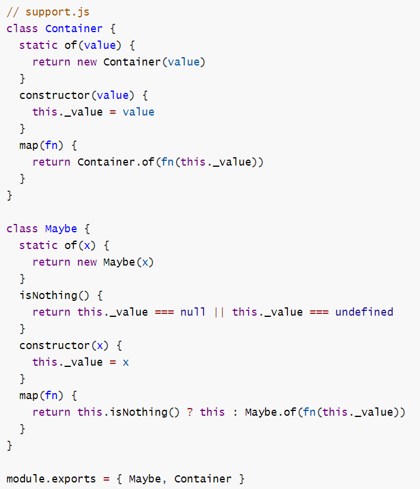

## 简答题

#### 谈谈你是如何理解 JS 异步编程的，EventLoop、消息队列都是做什么的，什么是宏任务，什么是微任务？

**答:**  
#### JS 异步编程  
JS引擎的代码执行是单线程的，但是编程中存在各种各样的场景需要进行异步处理，因此JavaScript提供了一些处理这些异步任务的api，例如定时任务、事件绑定、网络请求、等等。有了异步处理的机制可以大大提高程序的执行效率。  
#### EventLoop  
EventLoop是JS中对于事件的循环处理。当程序加载完script标签中的代码后，代码会经过预解析然后形成代码块依次执行。当遇到异步任务的时候，会开辟一个新的线程去处理它，例如定时任务。然后代码继续执行，在后续执行中可能还会遇到异步任务，例如网络请求。当同步代码执行结束后，会从消息队列中提取代码到执行栈中执行。通常我们将每一次的循环称为一个tick。
#### 消息队列  
消息队列是存放异步任务执行结束后的回调函数的，它的执行顺序，根据异步任务一般是按照执行的快慢，先后进入消息队列。但异步任务存在优先级，微任务的优先级高于宏任务，因此微任务会被放到消息队列的最前方，等js同步代码后就执行。当然在消息队列中的代码依次进入执行栈执行时，又可能产生新的异步任务会开辟新的线程处理它，之后根据异步任务的优先级进行排队。微任务也会形成一个对列，可以把它理解为银行柜台的VIP队列，前一个宏任务执行完后，优先去这个队列依次执行。 如此重复，响应事件的触发和执行事件的回调。
##### 宏任务和微任务
上面讲到异步任务进入消息队列的顺序一般按照执行的快慢，但是为了提高代码的执行效率，异步任务又区分了优先级。异步任务可以分为宏任务和微任务，常见的script标签、js主线程代码执行、setTimeout、setImmediate、I/O操作、 UI渲染等都是宏任务，而node中的process.nextTick、JavaScript中的Promise、MutationObserver等都是微任务。  
ES6 规范中，microtask 称为 jobs，macrotask 称为 task。宏任务是由宿主发起的，而微任务由JS自身发起。微任务不会触发新一轮的Tick，会在前一个宏任务的结束优先执行。

## 代码题

#### 准备工作

- 进入 code 目录, 
- 初始化项目生成 package.json
- 并且安装 lodash

#### 代码1

打开 code / code1.js , 按其中要求编写完成代码

　

#### 代码2

打开 code / code2.js 编辑补全代码, 完成4个练习要求

　

#### 代码3

**1) 参照下面图片敲代码, 创建 code / support.js 文件**

**2) 打开 code / code3.js 编辑补全代码, 完成4个练习要求**

　

#### 代码4

打开 code / promise-es6.js , 尽可能还原 Promise 中的每一个函数, 并通过注释描述思路和原理

打开 code / promise-es5.js , 尽可能还原 Promise 中的每一个函数, 并通过注释描述思路和原理

　

　
