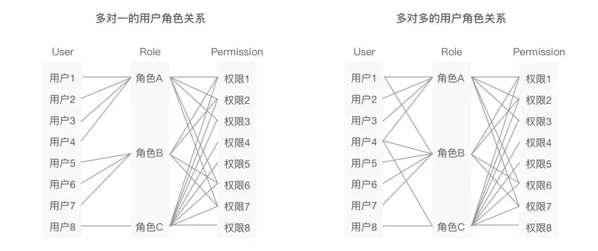
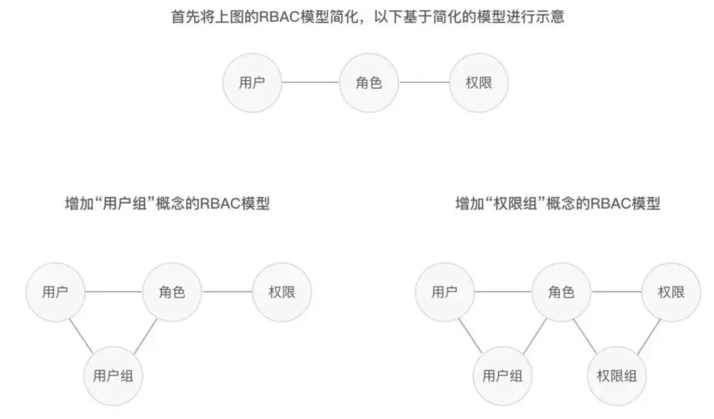
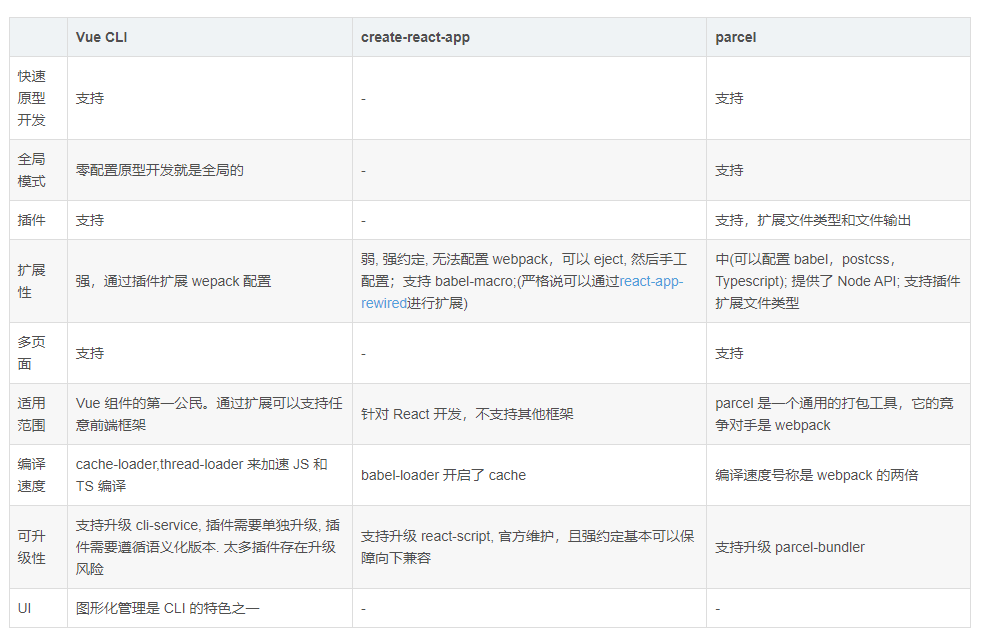
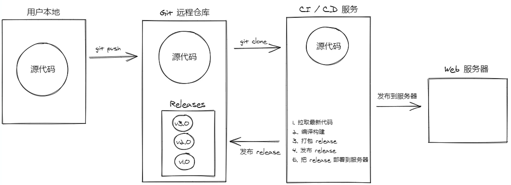

## 新作业

#### 解答题：

**1.说说 application/json 和 application/x-www-form-urlencoded 二者之间的区别。**  
- 1、`HTTP` 协议是以 `ASCII` 码传输，建立在 `TCP/IP` 协议之上的应用层规范。规范把`HTTP` 请求分为三个部分：请求行、请求头、消息主体。协议规定`POST`提交的数据必须放在消息主体（`entity-body`）中，但协议并没有规定数据必须使用什么编码方式。说到`POST`提交数据方案，包含了`Content-Type`和消息主体编码方式两部分。
- 2、`application/x-www-form-urlencoded`比较常见的`POST`提交数据的方式。浏览器的原生表单如果不设置`enctype`属性，则最终会以`application/x-www-form-urlencoded`的方式提交数据。发送过程中会对数据进行序列化处理，数据被编码成以`&`分割，以键值对形式?key1=value1&key2=value2的方式发送到服务器。非字母或数字的字符会被 [percent-encoding](https://developer.mozilla.org/zh-CN/docs/Glossary/percent-encoding)
   - 优势：所有的浏览器都兼容。
   - 问题：在数据结构及其复杂时，服务端数据解析变得很难
```
    POST http://www.example.com HTTP/1.1
    Content-Type: application/x-www-form-urlencoded;charset=utf-8
    title=test&sub%5B%5D=1&sub%5B%5D=2&sub%5B%5D=3
```
- 3、`application/json`:是目前比较流行的一种数据提交方式。它的参数体是一个`json`，不需要对参数体进行序列化处理。后端只需要对`json`进行解析。如果要提交`json`格式的数据，还需要在请求头中加入`content-type: application/json`。用来告诉服务端消息主体是序列化后的`JSON`字符串。由于`JSON`规范的流行，除了低版本`IE`之外的各大浏览器都原生支持`JSON.stringify`，服务端语言也都有处理`JSON`的函数
  - 优势：前端不用关系数据结构的复杂度，后端解析方便
  - 问题：少数浏览器不兼容

**2.说一说在前端这块，角色管理你是如何设计的。**
- 权限系统的由来：当角色之间的使用场景不冲突的时候，不需要进行隔离，此时我们会会综合考虑这些角色的使用场景来设计解决方案。比如在使用网易云音乐需要为听歌和听电台的用户，提供所有的功能。但当角色的使用场景完全不重叠、流程对立时，我们会设计两套系统，如滴滴的司机端和乘客端。但除了以上2种情况，大多数`B`端产品，基于流程公正性、信息安全性等因素考虑，各个角色的使用场景是部分通用，部分隔离的，这时候就需要引入“权限系统”。
- 在业界接受度较高的功能权限模型是`RBAC`（`Role-Based Access Control`）模型，其基本理念是将“角色”这个概念赋予用户，在系统中用户与权限之间通过角色进行关联，以这样的方法来实现灵活配置。
  - 下图即是`RBAC`模型中最基本的模型：  
  用户与角色可为多对一或多对多的关系，当一个用户的角色为多对多时，当前用户的权限是多个角色的并集。此时只需要为角色赋予权限，能够大大减轻管理负担，同时将用户与权限解耦，提供更大的灵活性。
  
  - 引入用户组概念的`RBAC`模型：  
  在大型平台的应用上，试想如果用户量上万，新增一个角色时，可能需要为大量用户都分配一遍新的角色，工程量仍然巨大，此时即可以引入用户组的概念。如果部分用户的使用场景是相对一致和基础的，我们可以把这些用户打包成一个组，基于这个组的对象进行角色和权限的赋予。同理如果权限较多时也会存在一样的问题，处理方式是引入权限组的概念，将使用场景相对固定的一组功能或权限打包成组赋予角色。但是一般来讲一个系统中权限功能的体量是相对有限和可控的，所以实际应用中对权限组的使用较少。
  
- 不同的角色拥有不同的菜单和不同资源，然后把这些角色分配给不同的用户，那对应的用户就拥有了相应的菜单和资源的权限了。
- 角色的管理包含了新角色的添加，已存在角色的编辑和删除以及给角色分配菜单和资源
- 角色就是权限的一个分组，资源就是接口，分配资源就是确定相应的接口请求权限
- 菜单就是一类功能的入口，分配菜单就是确定是相应的页面访问权限  　

**３.@vue/cli 跟 vue-cli 相比，@vue/cli 的优势在哪？**
- `vue-cli`本质上只是从 GitHub 拉取模版，它就像一个模版拷贝器。
  - 由于提供多个模版，一方面让初级开发者无所适从，另一方面模版之间也难以共享功能或是互相迁移。使得模版本身变得极其复杂和难以维护
  - `webpack` 配置和构建包含在仓库内，一旦用户对这些部分做了修改，就很难再获得源模版的更新和升级，而且会影响其他关联的插件
- `@vue/cli`做了哪些改进？
  - 抽离`cli service`层  
  `@vue/cli`库现在包含两个模块:`CLI`: 即`vue`全局命令，主要用于项目创建和管理，包含了`vue create`、`vue ui`这些命令。`CLI`命令的做的事情比较少，所以更新不会太频繁(开发者也很少会去更新这些命令)。`Service`层: 负责项目的实际构建，也就是`webpack`项目构建。这一块是频繁更新的，一般作为项目的局部依赖。分离了`vue-cli-service`之后，项目构建更新只是一个命令的事情，除非做了很多特殊化操作。特殊化操作应该封装到`vue-cli`的插件中。
  - 插件化  
  相比`create-react-app`, `vue-cli`是在”太仁慈“了。`vue-cli`的插件机制很灵活，通过`webpack-chain`和`webpack-merge`可以实现`webpack`完全定制化。  
  可以对比一下市面上流行的cli工具的可扩展性：
    
  - `GUI`界面  
  主要就是为了降低使用门槛，因为命令行能展示的交互很有限，所以默认用户对于创建项目时涉及的各种工具和配置项都有基本的了解。而 GUI 可以提供更多的信息帮助用户了解这些东西是干嘛的。另外 GUI 也能提供一些命令行难以展示的信息，比如通过可视化的图表分析打包后各个模块的大小占比等。
  - 快速原型开发
  支持直接将一个`vue`文件跑起来，快速原型开发或验证某些想法。
- 统一和规范对团队来说才是最重要的。便于维护和升级以及拥有强约定性、弱配置更易于开发。如果你要做**深度**的`vue-cli`定制化，不建议直接写在`vue.config.js`中，而是封装在插件中，独立的维护这个插件，然后项目再依赖这个插件。这样就可以简化升级的成本和复杂度。

**４.详细讲一讲生产环境下前端项目的自动化部署的流程。**
- 现代化的部署方式（CI-持续集成/CD-持续部署、交付），简易流程如下：
 　
- 使用`GitHub Actions`实现`CI/CD`服务
  - 准备工作：一台`Linux`服务器、把代码提交到`Github`远程仓库
  - 配置`Github Access Token`：作用是在`CI/CD`服务中要使用到`Github`的用户身份令牌来访问和操作`Github`仓库
    - 在`Github`主页右上角 `Settings --> Developer settings --> Personal access tokens --> Generate new token`起一个名称， 勾选第一个选项 `repo`权限。得到`token`保存后续使用，这个`token`**只出现一次**
    - 进入代码托管的远程仓库页面,在项目中点击`Settings --> Secrets --> New repository secret`,设置`TOKEN`名字：`value`中填写上一步获得的`token`;`HOST`内容： 服务器外网 `ip`;`PORT` 内容： 默认 22;`USERNAME` 内容：`root`
    - 项目根目录创建`pm2.config.json`
    ```js
        {"apps": [{
            "name": "RealWorld",
            "script": "npm",
            "args": "start"
        }]}
    ```
  - 配置`Github Actions`执行脚本
    - 项目根目录创建`.github/workflows/main.yml`并编写执行的任务
  - 将所有代码提交`git`创建`tag`提交,提交成功后在`github`项目仓库的`Actions`中查看构建状态`Acctions`,点击 `Releases`查看历史版本

**５.你在开发过程中，遇到过哪些问题，又是怎样解决的？请讲出两点。**
- 1、vue项目路由的自动加载：由于项目功能逐渐增多，路由系统新增及配置比较繁琐，要解决这个问题可以使用`webpack`提供的`API`解决,核心代码如下：
```js
    // 遍历require.context获取的文件目录中的index.js并加载。index.js文件再加载下级的路由配置。
    const requireAll = (requireContext) =>
        requireContext.keys().map((key) => {
            return requireContext(key).default;
        });
    // 注意：require.context的参数必须是常量
    const systemRouters = requireAll(require.context('./system', true, /index.js$/))
```
- 2、强制组件重新渲染的正确方法: 有时候依赖`Vue`响应式来更新数据并不能实现需求（如一些缓存组件），因此需要我们手动重现渲染组件，那么何让`Vue`以正确的方式重新呈现组件呢？
  - 简单粗暴的方式：重新加载整个页面（但对于单页面应用会导致丢失一些数据）
  - 不妥的方式：使用`v-if`,如下例.(在这个过程中，有2个部分比较重要:1、必须等到nextTick，否则我们不会看到任何变化。2、其次，当第二次渲染时，`Vue`将创建一个全新的组件)
  ```js
    <script>
    export default {
        data() {
        return {
            renderComponent: true,
        };
        },
        methods: {
        forceRerender() {
            // 从 DOM 中删除 my-component 组件
            this.renderComponent = false;
            
            this.$nextTick(() => {
            // 在 DOM 中添加 my-component 组件
            this.renderComponent = true;
            });
        }
        }
    };
    </script>
  ```
  - 较好的方法：`forceUpdate` 方法,当我们调用forceUpdate时，也可以强制执行更新，即使所有依赖项实际上都没有改变。
  ```js
    // 有两种不同的方法可以在组件实例本身和全局调用forceUpdate
    // 全局
    import Vue from 'vue';
    Vue.forceUpdate();

    // 使用组件实例
    export default {
        methods: {
            methodThatForcesUpdate() {
            // ...
            this.$forceUpdate();
            // ...
            }
        }
    }
    // 注意：这不会更新任何计算属性，调用forceUpdate仅仅强制重新渲染视图。
  ```
  - 最好的方法：在组件上进行`key`更改。要正确地做到这一点，我们将提供一个key属性，以便 Vue 知道特定的组件与特定的数据片段相关联。如果key保持不变，则不会更改组件，但是如果key发生更改，Vue 就会知道应该删除旧组件并创建新组件。
  ```js
    <template>
        <component-to-re-render :key="componentKey" />
    </template>

    export default {
        data() {
            return {
                componentKey: 0,
            };
        },
        methods: {
            forceRerender() {
                this.componentKey += 1;  
            }
        }
    }
  ```

**６.针对新技术，你是如何过渡到项目中？**

- 首先明确职业规划中，必备的技能。由技能拓展知识面，同时积累经验，在项目实战遇到一些场景需求和问题。考虑解决问题的方案，从技术层面上现有的技术储备无法更好的解决问题，就需要考虑引入新的技术到项目中。
- 解决问题的方案是一类技术，需要了解是否适合项目、学习和维护成本以及是否具有普适性和可迭代更新等特点。类似的技术方案很多，我们需要学习更具发展性，比较成熟和典型标准的技术。
- 学习一项新技术，首先从阅读官方文档开始，了解技术的适用范围和特点以及正确的使用方式。其次试手新技术的官方仓库代码示例熟悉基本和进阶的用户，然后找到具备典型应用场景的项目工程，了解更多场景下新技术的使用，进一步理解技术的优势和特点。
- 当对新技术的比较了解以及熟练使用后，首先评估应用到维护项目中的成本和风险，对于多人协作的项目，需要考虑团队成员对新技术的接受程度。若没有相关的使用经验可以进行集中的培训和指导，让成员都熟悉基本使用和技术的优势。
- 当团队成员都比较熟悉或个人维护项目就可以将新技术过渡到项目中。若是旧版本的项目还需要考虑新技术是否可以覆盖全部功能？升级新技术后兼容性是否下降？新技术相对于老技术具体在哪些方面做了提升和改进？
- 当旧项目成功使用新技术重构后，需要持续关注新技术的动态，对于变动不大的情况，注意升级稳定版本。

　
[权限参考文章](http://www.woshipm.com/pd/1214616.html)


## 原作业: 
##### 网页访问地址：http://106.75.13.23:3020/

1.完成视频中老师提出的作业要求

2.100% 还原视频中所讲到的内容

3.完成剩下的几个模块

4.没有权限的模块，暂时不做啊，比如删除（删除东西容易导致服务器崩了）


**作业接口文档地址**

http://113.31.104.154:8081/doc.html#/home

http://113.31.104.154:8010/doc.html#/home

如果ip访问出现问题 请访问下面的

```
http://edufront.lagou.com/front/doc.html#/home
```

```
http://eduboss.lagou.com/boss/doc.html#/home
```

　

**原型图 地址**

eduboss.lagou.com

用户账号 密码

[http://eduboss.lagou.com](http://eduboss.lagou.com/)

用户名：15510792995     密码：111111
用户名：18201288771     密码：111111

　

**硬性要求**

大家不要在3-6的系统中删除数据，可以自己新增，修改或是删除自己新增的数据，否则服务器总是出问题哈

学员自己的资源 name有固定前缀 比如: 共用前缀test + 自己前缀+业务名称diy， 比如： test_lnw_menu1

作业要求:凡是里面没有权限的模块，都可以不用做哈